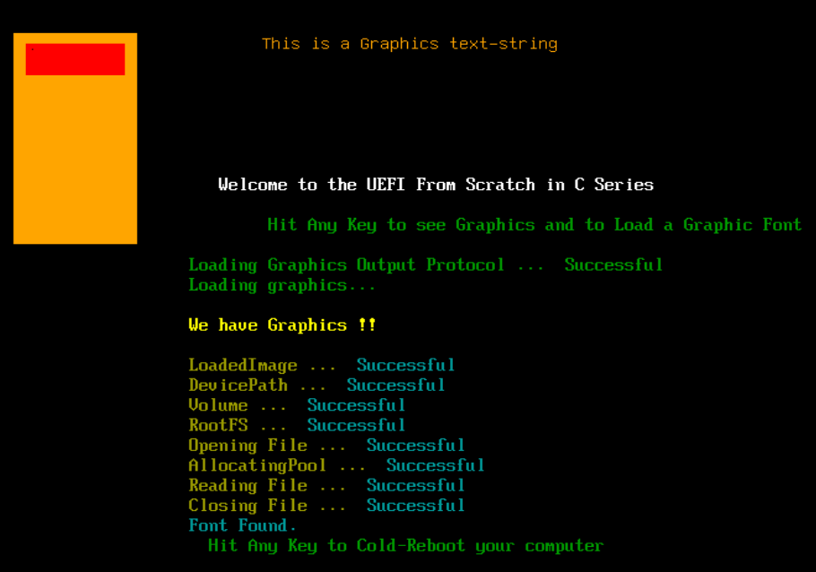
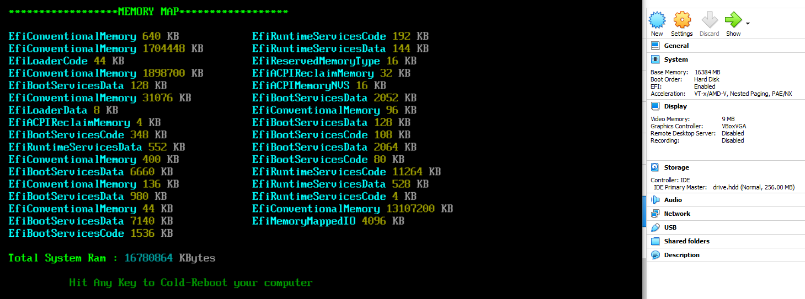
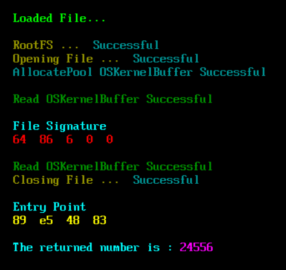

# The UEFI From Scratch in C

## This is source code to the rebooted youtube series - UEFI From Scratch.  

This series is based off of the Unified Extensible Firmware Interface Official Specs.  
https://uefi.org/specifications

**NOTE :** Although this is all done completely within windows, with NO Linux involvement,  
you can compile the code in linux if you are properly setup for it.  

**UPDATED NOTE :** Youtube17 is all about loading and working with Poncho's Kernel with the UEFI From scratch series as the EFI loader.  

**NOTE 2 :** Makefile - The MinGW version I'll be using comes with Make. But you can use your own Make program if you choose.  

**NOTE 3 :** This code works on real hardware, not just VirtualBox.  

## Tools Needed  
A C compiler. This series uses MinGW ( GCC ) 9.2.  
**No Cross-compiler needed.**  
https://nuwen.net/mingw.html

VirtualBox ( Or use qemu if that is your preference. This series uses VB. )  
https://www.virtualbox.org/

ALTERNATIVE to VirtualBox - QEMU  
Watch my Youtube video on which version to get and how to not only install but how to run.  
INSTALL - https://www.youtube.com/watch?v=bh4GkpAKYII  
EFI VERSION - https://www.youtube.com/watch?v=XudHa7Pnot4  

Free Hex Editor  
https://mh-nexus.de/en/hxd/

OSFMount - Program to mount our HDD Image File  
https://www.osforensics.com/tools/mount-disk-images.html

# PROGRESS:
    - [x] TEXT  
    - [x] COLOR  
    - [x] KEYBOARD  
    - [x] ERROR CHECKING  
    - [x] LIBS HEADER FOR CLEANER CODE  
    - [x] SIMPLE-TEXT CURSOR POSITIONS  
    - [x] CLEAR SCREEN VS RESET SCREEN  
    - [x] GOP 1 - GRAPHICS OUTPUT PROTOCOL  
    - [x] GOP 2 - GRAPHICS OUTPUT PROTOCOL  
    - [x] COMPUTER REBOOT - COLD, WARM, SHUTDOWN  
    - [x] FILE SYSTEM LOADING  
    - [x] OPEN FILE HANDLE  
    - [x] CLOSE FILE HANDLE  
    - [x] ALLOCATEPOOL AND READ FILE INTO BUFFER  
    - [x] FILE VERIFICATION  
    - [x] GRAPHIC TEXT  
    - [x] MEMORY MAP  
    - [x] RUNNING A FILE - FILE OFFSETS ( ALIGNMENT ), FILE HEADERS AND THE STACK  

