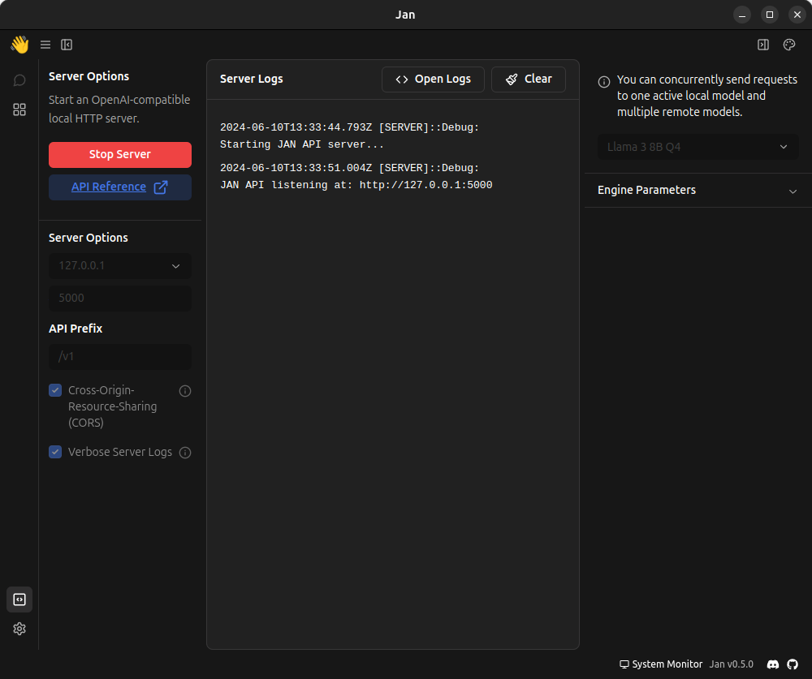

# How to Use LLM in Kotlin

## Installing the OpenAI API Emulator on Your Machine

To get started, you'll need to install an emulator on your machine. I used Jan, but feel free to use any emulator you prefer.

1. Start by installing llama3-8b-instruct. If you want to install a different language, you'll need to update core.c and then recompile it.
2. Next, launch the server on port 5000 and IP address 127.0.0.1. If you'd like to change these settings, you'll need to modify `core.c` and then recompile it (`PACKAGE=llm make build`).
3. Once the server is up and running, you can start it as shown in the following illustration:

## Running LLM in Kotlin

To use LLM in Kotlin, simply type `llm <question>` and wait for the answer. Keep in mind that it may take a few minutes to receive a response.
